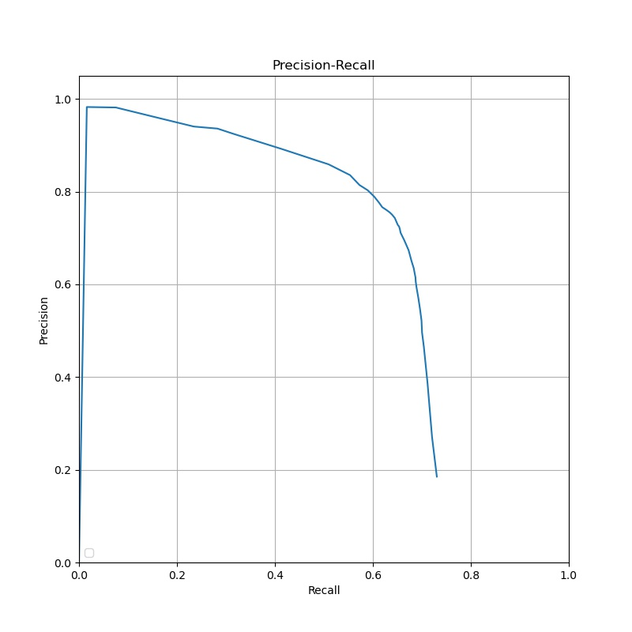
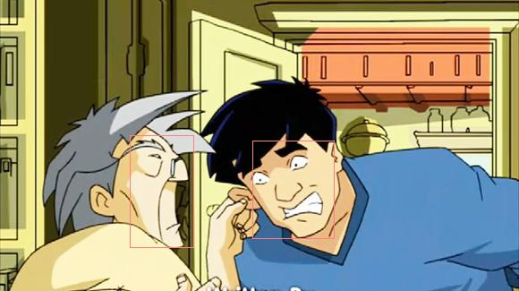

# Nana动画人物脸部检测

南京大学软件学院大三年级计算机视觉课程实验作业

## 下载链接

### model - 百度网盘或谷歌

链接：https://pan.baidu.com/s/1dGNtI39IY4P_4qVH7zxRQA 
提取码：9gt4

https://drive.google.com/file/d/1OHRR-jIwDC_UxATt3REimStY4K9wK831/view?usp=sharing

### 训练集

训练集为教师提供的，就不传了

## 目录结构

```
Desktop
├─cartoon_dataset	- 数据集
	├─cartoon_test	- 测试数据集
		└─......
	├─cartoon_train	- 训练数据集
		└─......
	└─train.txt		- 训练bbox数据
├─model
	└─model.pth		- 训练的模型
├─plt
	└─pr.jpg		- 根据检验结果生成的precision-recall曲线
├─result
	├─test_result.txt	- 预测测试数据生成的结果
	└─........		- 直接检验特定单一图片时生成的结果
├─dataset.py		- 生成的数据集类
├─demo.py			- 项目demo
├─model.py			- 项目模型结构，直接使用了pytorch内置的fasterrcnn_resnet50_fpn
├─predict.py		- 使用模型预测结果
├─train.py			- 训练模型
└─transform.py		- 同时对图像和target bbox进行变换
```

## Requirements

- pytorch == 1.5.0
- torchvision == 0.6.0
- python == 3.7
- NVIDIA GPU == NVIDIA GeForce GTX 1060 with Max-Q Design

## 运行

没搞argument-parser，所以就在demo.py里注释特定行然后运行

### 训练

```python
from model import faster_rcnn
import torch
from train import train, evaluate_model


model = faster_rcnn(pretrained=False)
device = torch.device('cuda') if torch.cuda.is_available() else torch.device('cpu')


if __name__ == '__main__':
    train(model, device, num_epochs=10)
    evaluate_model(model, device, test_size=2000)
```

训练会将训练完成的模型保存到model/model.pth

之后使用训练集中提取2000个进行测试生成pr曲线，该曲线保存在plt/pr.jpg

### 测试

```python
from model import faster_rcnn
import torch
from predict import predict, detect_image


model = faster_rcnn(pretrained=True)
device = torch.device('cuda') if torch.cuda.is_available() else torch.device('cpu')


if __name__ == '__main__':
    predict(model, device)
    detect_image(model, device, 'cartoon_dataset/cartoon_test/008207.jpg')
```

测试前需要将模型文件model.pth放入model目录下，并将获取模型函数的pretrained参数设为真，默认使用cartoon/dataset/cartoon_test目录进行测试，并会生成结果文本文件至result目录，文件名为test_result.txt

detect_image方法评估单一图像，并在result目录下生成同名图像，其中识别出的bbox会用红线标记

预测的默认分数阈值为0.89，经测试可以认为该阈值能在精确度和查全率上取得较好的平衡

## Precision-Recall曲线



- 注：Recall无法接近1.0的原因在于检测到对应的脸部，但bbox框过大或过小导致IOU小于0.7未被识别。

## 检测示例




